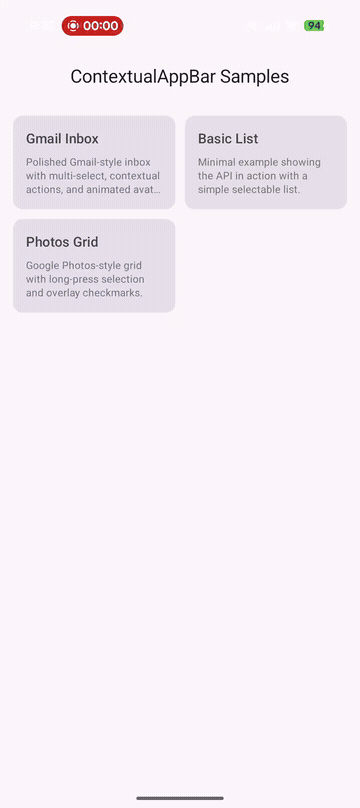

# Compose Contextual AppBar

[](https://central.sonatype.com/artifact/io.github.aldefy/contextual-appbar)
[](https://kotlinlang.org)
[](https://www.jetbrains.com/compose-multiplatform/)
[](LICENSE)

**Animated contextual top app bar for Compose Multiplatform** — the Gmail/Photos/Files multi-select pattern that Material 3 never shipped.

When users long-press to select items, the top bar smoothly crossfades to show selection count and contextual actions (delete, share, archive). Back press exits selection mode.

<p align="center">
  
</p>

## Installation

```kotlin
// build.gradle.kts
kotlin {
    sourceSets {
        commonMain.dependencies {
            implementation("io.github.aldefy:contextual-appbar:<version>")
        }
    }
}
```

## Quick Start

### MaterialContextualTopAppBar (recommended)

```kotlin
MaterialContextualTopAppBar(
    selectedCount = selectedIds.size,
    onClearSelection = { selectedIds = emptySet() },
    contextualNavigationIcon = {
        IconButton(onClick = { selectedIds = emptySet() }) {
            Icon(Icons.Default.Close, contentDescription = "Clear")
        }
    },
    contextualActions = {
        IconButton(onClick = { /* delete */ }) {
            Icon(Icons.Default.Delete, contentDescription = "Delete")
        }
        IconButton(onClick = { /* share */ }) {
            Icon(Icons.Default.Share, contentDescription = "Share")
        }
    },
    defaultBar = {
        TopAppBar(title = { Text("My App") })
    },
)
```

### ContextualTopAppBar (raw, full control)

```kotlin
ContextualTopAppBar(
    selectedCount = selectedIds.size,
    onClearSelection = { selectedIds = emptySet() },
    contextualContent = { count ->
        // Your completely custom contextual bar
        MyCustomContextualBar(count)
    },
    defaultContent = {
        // Your normal bar
        TopAppBar(title = { Text("My App") })
    },
)
```

## Components

| Component | Purpose |
|-----------|---------|
| `ContextualTopAppBar` | Raw wrapper — crossfades between any two composables based on selection count |
| `MaterialContextualTopAppBar` | M3 convenience — provides TopAppBar with primaryContainer colors for contextual state |
| `ContextualTopAppBarDefaults` | Default colors and animation specs |

## Features

- Animated crossfade between default and contextual bars
- Back press interception (Android) — exits selection, doesn't navigate
- Material 3 colors (primaryContainer) out of the box
- Custom animation specs supported
- Works with any TopAppBar variant (small, medium, large)
- KMP: Android, iOS, Desktop, WasmJs

## License

```
Copyright 2026 Adit Lal

Licensed under the Apache License, Version 2.0
```
